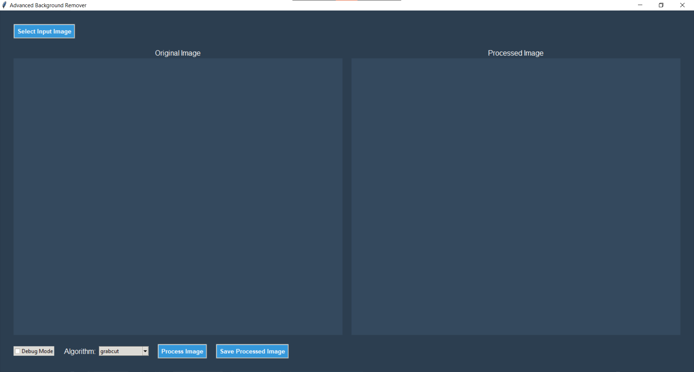

# 🖼️ Advanced Background Remover

## Overview

Advanced Background Remover is a powerful, user-friendly desktop application that allows you to easily remove backgrounds from images using advanced computer vision techniques. Built with Python and OpenCV, this tool provides an intuitive graphical interface for image background removal.


## 🌟 Features

- **Advanced Background Removal**: Utilizes sophisticated computer vision algorithms
- **Real-time Preview**: See processed images instantly
- **Multiple Image Format Support**: Works with JPG, PNG, BMP, and more
- **Debug Mode**: Visualize background detection process
- **Easy-to-Use Interface**: Simple, intuitive design

## 🛠 Technologies Used

- Python
- Tkinter (GUI)
- OpenCV (Image Processing)
- NumPy (Numerical Computing)
- Pillow (Image Manipulation)

## 📦 Prerequisites

Before you begin, ensure you have the following installed:

- Python 3.8+
- pip (Python Package Manager)

## 🚀 Installation

1. Clone the repository:
```bash
git clone https://github.com/nethinduhansaka-dev/advanced-background-remover.git
cd advanced-background-remover
```

2. Create a virtual environment (optional but recommended):
```bash
python -m venv venv
source venv/bin/activate  # On Windows, use `venv\Scripts\activate`
```

3. Install required dependencies:
```bash
pip install -r requirements.txt
```

## 🖥️ Running the Application

```bash
python background_remover.py
```

## 📝 How to Use

1. Click "Select Input Image" to choose an image
2. Preview the original image
3. Click "Process Image" to remove the background
4. Use "Save Processed Image" to save the result

### Debug Mode

Check the "Debug Mode" checkbox to generate a visualization of the background removal process.

## 🔍 Background Removal Technique

The application uses a multi-step approach:

1. **Image Preprocessing**
   - Bilateral filtering to reduce noise
   - Color space conversion for better segmentation

2. **Initial Segmentation**
   - K-means clustering
   - Color-based segmentation

3. **Mask Refinement**
   - Morphological operations
   - GrabCut algorithm
   - Edge-aware refinement

## 🤝 Contributing

Contributions are welcome! Please follow these steps:

1. Fork the repository
2. Create your feature branch (`git checkout -b feature/AmazingFeature`)
3. Commit your changes (`git commit -m 'Add some AmazingFeature'`)
4. Push to the branch (`git push origin feature/AmazingFeature`)
5. Open a Pull Request

## 🐛 Known Issues

- Large images may take longer to process
- Some complex images might require manual refinement

## 📋 Roadmap

- [ ] Add machine learning-based background removal
- [ ] Implement user-guided segmentation
- [ ] Support batch processing
- [ ] Add more color space segmentation techniques

## 📸 Screenshots




## 📄 License

Distributed under the MIT License. See `LICENSE` for more information.

## 📞 Contact

nethinduhansaka-dev - [nethinduhansaka6113@gmail.com](mailto:nethinduhansaka6113@gmail.com)

Project Link: [https://github.com/nethinduhansaka-dev/advanced-background-remover](https://github.com/nethinduhansaka-dev/advanced-background-remover)

---

**Enjoy removing backgrounds with ease! 🎨**